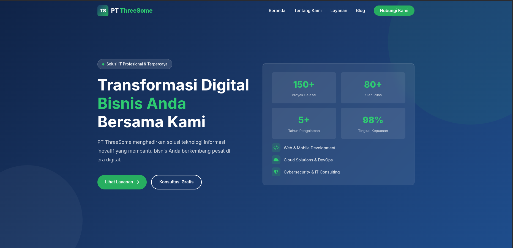
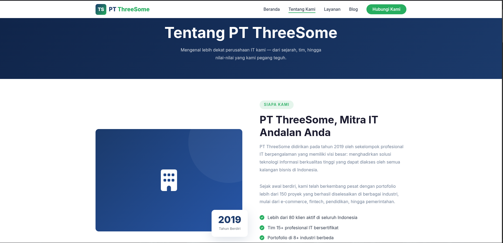
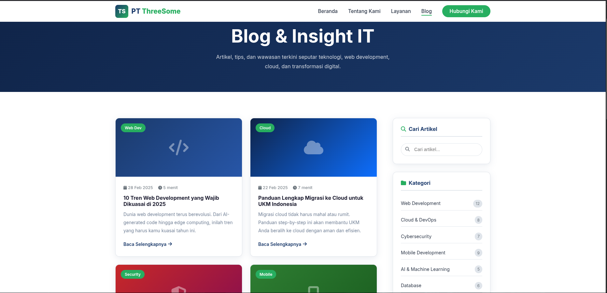
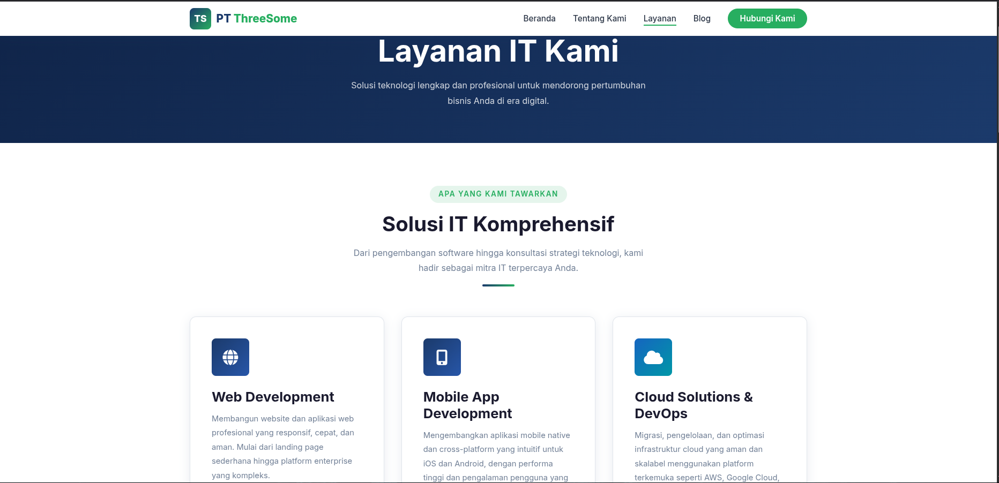
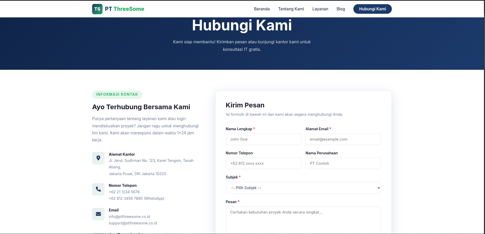

# Threesome Website

Website multi-halaman yang dibangun pakai Node.js dan Express.js sebagai backend server buat nyajiin halaman statis.

Project ini dibuat buat nunjukin gimana arsitektur dasar aplikasi web pakai Node.js yang ngelayanin file HTML, CSS, dan JavaScript langsung dari folder public.

---

# ✨ Fitur

* Website multi halaman
* Backend menggunakan Node.js dan Express
* Struktur frontend sederhana dan rapi
* Layout responsif
* Server lokal untuk pengembangan
* Pengiriman email menggunakan Nodemailer (jika diaktifkan)

---

# 🛠 Tech Stack

Backend

* Node.js
* Express.js

Frontend

* HTML5
* CSS3
* JavaScript

Tools

* Nodemon
* Dotenv
* Git

---

# 📸 Screenshot Website

## Homepage



---

## About Page



---

## Blog Page



---

## Services Page



---

## Contact Page



---

# 📦 Instalasi Depedencies Sebelum Menjalankan Project

Pastikan software berikut sudah terinstall di komputer Kalian:

1. Node.js (versi 18 atau lebih baru)
2. npm
3. Git

Cek apakah sudah terinstall dengan perintah berikut:

```bash
node -v
npm -v
git --version
```

Jika semua menampilkan nomor versi maka sistem sudah siap.

---

# 💻 Instalasi Berdasarkan Sistem Operasi

## Linux

Project ini dapat dijalankan pada berbagai distribusi Linux seperti Debian, Ubuntu, Fedora, dan Arch Linux.

### Debian / Ubuntu

Install Node.js dan Git

```bash
sudo apt update
sudo apt install nodejs npm git
```

Cek instalasi

```bash
node -v
npm -v
```

---

### Fedora

Install Node.js dan Git

```bash
sudo dnf install nodejs npm git
```

Cek instalasi

```bash
node -v
npm -v
```

---

### Arch Linux

Install Node.js dan Git

```bash
sudo pacman -S nodejs npm git
```

Cek instalasi

```bash
node -v
npm -v
```

---

## macOS

Disarankan menggunakan **Homebrew** untuk menginstall Node.js.

### Install Homebrew

```bash
/bin/bash -c "$(curl -fsSL https://raw.githubusercontent.com/Homebrew/install/HEAD/install.sh)"
```

### Install Node.js dan Git

```bash
brew install node
brew install git
```

Cek instalasi

```bash
node -v
npm -v
```

---

## Windows

### Install Node.js

Download dari website resmi:

https://nodejs.org

Pilih versi **LTS** dan ikuti proses instalasi sampai selesai.

---

### Install Git

Download dari:

https://git-scm.com

Install dengan pengaturan default.

---

### Verifikasi Instalasi

Buka Command Prompt atau PowerShell lalu jalankan:

```bash
node -v
npm -v
git --version
```

Jika muncul nomor versi maka instalasi berhasil.

---

# 🚀 Cara Menjalankan Project

Clone repository

```bash
git clone https://github.com/yudiiansyaah/threesome-website.git
```

Masuk ke folder project

```bash
cd threesome-website
```

Install dependency

```bash
npm install
```

Menjalankan server

```bash
npm start
```

Jika menggunakan nodemon untuk development

```bash
npm run dev
```

---

# 🌐 Mengakses Website

Setelah server berjalan, buka browser dan akses:

```
http://localhost:3000
```

Website akan tampil di browser Kalian.

---

# 📁 Struktur Project

```
threesome-website
│
├── public
│   ├── index.html
│   ├── about.html
│   ├── blog.html
│   ├── services.html
│   ├── contact.html
│   │
│   ├── css
│   │   └── style.css
│   │
│   └── js
│       └── main.js
│
├── screenshots
│
├── server.js
├── package.json
├── package-lock.json
└── README.md
```

---

# 📜 License

Project ini menggunakan lisensi ****.

Silakan menggunakan, memodifikasi, dan mendistribusikan project ini sesuai ketentuan lisensi.
